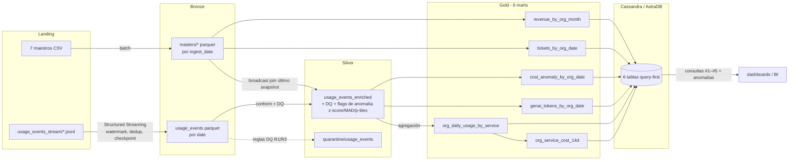
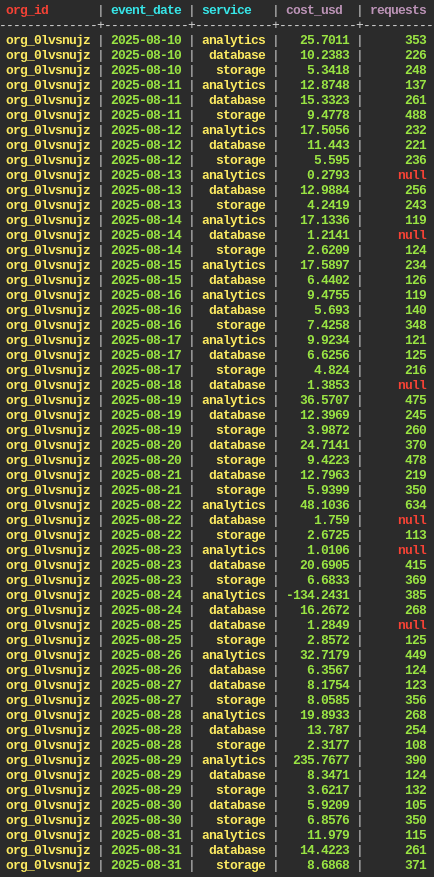
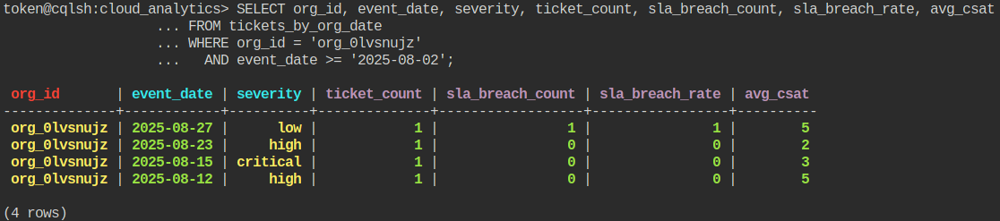
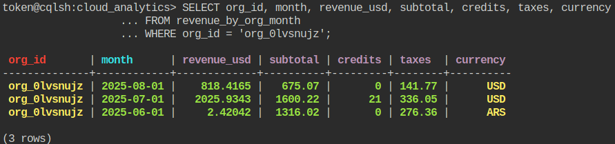
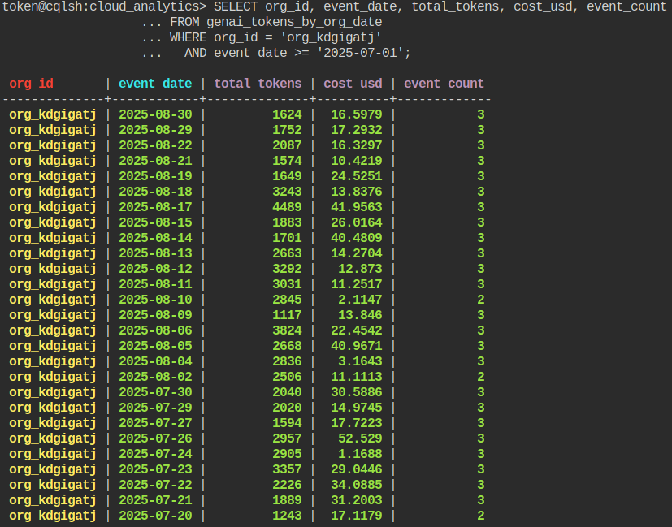
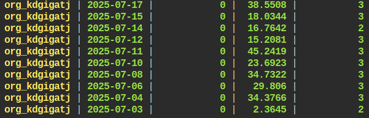
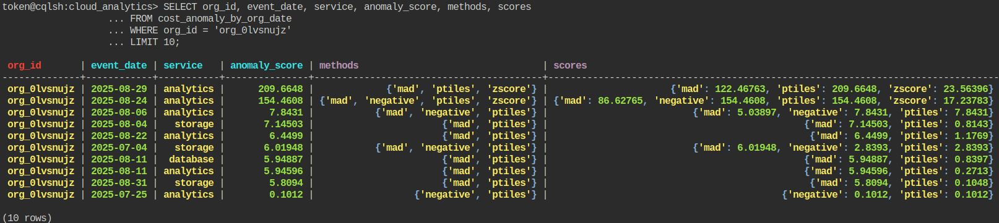
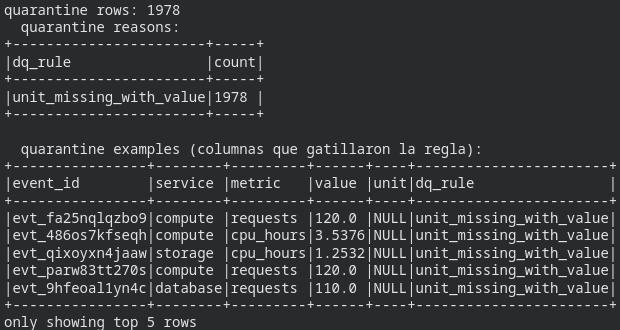

# Big Data Trabajo Final — Cloud Provider Analytics

**Materia:** Big Data — 72.80

**Fecha de entrega:** 13/07/2026

**Integrantes:**

- Perez de Gracia, Mateo (63401)
- Quian Blanco, Francisco (63006)
- Stanfield, Theo (63403)

---

## Objetivo

Un pipeline de datos mínimo pero completo que conecta todas las capas:

```
Landing → Bronze → Silver → Gold → Serving (Cassandra/AstraDB)
```

Implementado con PySpark + Structured Streaming, Parquet como almacenamiento
intermedio y Cassandra/AstraDB como capa de serving query-first, sobre el dataset
provisto Cloud Provider Analytics (7 maestros CSV + 120 archivos JSONL de usage
events).

Todo el pipeline es un único script, `pipeline.py` (formato jupytext "percent"),
con las transformaciones puras factorizadas en `cpa.py` y la capa de serving de
Cassandra en `serving.py`. `pipeline.ipynb` es el notebook generado para Colab.

---

## Arquitectura

**Patrón Lambda**, acotado al MVP: el camino **batch** cubre los maestros, y el
camino **streaming** cubre landing→Bronze de los usage events. Todo lo que sigue
(Silver, Gold, serving) corre como **batch** sobre el Parquet de Bronze. Ambos
caminos convergen en Silver vía el join de enriquecimiento.



---

## Estructura del repositorio

```
final/
  pipeline.py        # driver (jupytext percent) — leer de arriba a abajo
  pipeline.ipynb     # notebook generado para Colab
  cpa.py             # puro: registro de esquemas + transformaciones Silver/Gold
  serving.py         # Cassandra connect / DDL / upsert / consultas
  cql/
    schema.cql       # keyspace + 6 tablas query-first
    queries.cql      # las 5 consultas de negocio + la de anomalías
  tests/             # pytest (esquema, Silver, Gold unit; serving integración)
  datalake/
    landing/         # datos fuente (versionados) — inmutable
    bronze/ silver/ gold/ quarantine/ checkpoints/   # generados (en gitignore)
  evidence/astra/    # capturas de las consultas corridas en AstraDB
```

---

## Requisitos previos

- Python 3.12 (lo fija `uv`)
- [uv](https://docs.astral.sh/uv/)
- JDK 17 o 21 (Spark 4.0 lo necesita; no soporta JDK 11)
- Cuenta en [AstraDB](https://astra.datastax.com) (serving por defecto en Colab),
  o Docker para correr Cassandra local (alternativa)

---

## Quickstart (AstraDB)

El serving va contra **AstraDB** (Cassandra serverless gestionada). El mismo
`pipeline.py` corre igual en tu máquina con `uv` o en Colab; lo único que cambia
es de dónde toma las credenciales de Astra.

### 1. Conseguir las credenciales de Astra (una sola vez)

1. Creá una base **Serverless** gratuita en [astra.datastax.com](https://astra.datastax.com).
2. Dentro de la base, creá el keyspace **`cloud_analytics`**.
3. Descargá el **Secure Connect Bundle** (`secure-connect-...zip`).
4. Generá un **Application Token** (`AstraCS:...`) con un rol que pueda escribir
   (p. ej. *Database Administrator*) y copiá el valor **completo**.

### 2a. Correr local con uv

```bash
cd final

# Entorno Python (uv fija Python 3.12 + instala pyspark, cassandra-driver, ...)
uv sync

# Correr el pipeline contra Astra
ASTRA_BUNDLE=/ruta/secure-connect-...zip \
ASTRA_TOKEN=AstraCS:xxxxx \
SERVING_TARGET=astra \
JAVA_HOME=/usr/lib/jvm/java-21-temurin-jdk \
uv run python pipeline.py
```

### 2b. Correr en Colab

Abrí `pipeline.ipynb` en Colab y corré de arriba a abajo. La primera celda
(**Bootstrap de Colab**) se autodetecta y hace todo el setup: clona este repo,
instala `pyspark` + `cassandra-driver` + un JDK 17, y se posiciona en
`final/` para que `cpa.py`, `serving.py` y `datalake/landing` queden en
rutas relativas. No hace falta nada manual.

La celda **AstraDB en Colab** (justo después del bootstrap) configura el serving
sola; antes de correrla, solo necesitás:

1. En Colab, panel **🔑 (Secrets)** → agregar un secret llamado **`ASTRA_TOKEN`**
   con el valor `AstraCS:...` y habilitar "Notebook access". Así el token no queda
   escrito en el `.ipynb`.
2. Al correr la celda, subir el **secure-connect-bundle** (`.zip`) en el file
   picker (queda cacheado; en re-runs no lo vuelve a pedir).

### Qué hace una corrida

Cualquiera de las dos vías ingesta los maestros + streamea los eventos a Bronze,
construye Silver (DQ + quarantine + anomalía multi-método), los **6 marts** de Gold,
carga las 6 tablas en Astra, ejecuta las **5 consultas de negocio** (#1–#5) más la
consulta extra de anomalías, e imprime la evidencia de idempotencia / particionado.
**Volvé a correrlo y los conteos por zona son idénticos** (ver [Evidencias](#evidencias)).

### Tests

```bash
JAVA_HOME=/usr/lib/jvm/java-21-temurin-jdk uv run pytest -q
```

Los tests unitarios de transformaciones puras (registro de esquemas, Silver, Gold)
siempre corren; los tests de serving de Cassandra corren si hay una Cassandra local
accesible, si no se saltean.

### Alternativa: Cassandra local con Docker

Si no podés usar Astra (sin conexión, problemas de credenciales, etc.), el serving
corre igual contra una Cassandra local en Docker — es el valor por defecto
(`SERVING_TARGET=docker`).

```bash
cd final
uv sync

# Cassandra local
docker run -d --name cpa-cassandra -p 9042:9042 cassandra:5
# esperar ~40s hasta que esté lista:
until docker exec cpa-cassandra cqlsh -e "describe keyspaces" >/dev/null 2>&1; do sleep 3; done

# Correr el pipeline (SERVING_TARGET=docker es el default)
JAVA_HOME=/usr/lib/jvm/java-21-temurin-jdk uv run python pipeline.py
```

---

## Consultas de negocio

Las cinco consultas obligatorias más una consulta extra de anomalías. Cada tabla de
serving modela exactamente la consulta que responde (query-first). El CQL exacto
está en `cql/queries.cql`.

### Consulta #1 — costo + requests diario por org + servicio (rango de fechas)

```cql
SELECT org_id, event_date, service, cost_usd, requests
  FROM org_daily_usage_by_service
 WHERE org_id = 'org_0lvsnujz'
   AND event_date >= '2025-07-01'
   AND event_date <= '2025-09-01';
```

Servida por `org_daily_usage_by_service`: partición por `org_id`, range-slice sobre
la columna de clustering `event_date`.

### Consulta #2 — top-N servicios por costo acumulado a 14 días

```cql
SELECT org_id, service, total_cost_usd
  FROM org_service_cost_14d
 WHERE org_id = 'org_0lvsnujz'
 LIMIT 5;
```

Servida por `org_service_cost_14d`, cuyo `CLUSTERING ORDER BY (total_cost_usd DESC)`
devuelve el top-N directo, sin sort del lado del cliente.

### Consulta #3 — tickets críticos y tasa de SLA breach por día (últimos 30 días)

```cql
SELECT org_id, event_date, severity, ticket_count, sla_breach_count, sla_breach_rate, avg_csat
  FROM tickets_by_org_date
 WHERE org_id = 'org_0lvsnujz'
   AND event_date >= '2025-08-02';
```

Servida por `tickets_by_org_date`; `CLUSTERING ORDER BY (event_date DESC)` entrega
los días recientes primero (el cliente puede filtrar por `severity`).

### Consulta #4 — revenue mensual con créditos/impuestos normalizado a USD

```cql
SELECT org_id, month, revenue_usd, subtotal, credits, taxes, currency
  FROM revenue_by_org_month
 WHERE org_id = 'org_0lvsnujz';
```

Servida por `revenue_by_org_month`; `revenue_usd = (subtotal − credits + taxes) ×
exchange_rate_to_usd` se calcula en Gold, así que la consulta ya lee USD.

### Consulta #5 — tokens GenAI y costo estimado por día

```cql
SELECT org_id, event_date, total_tokens, cost_usd, event_count
  FROM genai_tokens_by_org_date
 WHERE org_id = 'org_kdgigatj'
   AND event_date >= '2025-07-01';
```

Servida por `genai_tokens_by_org_date` (solo eventos de `service = 'genai'`). Ojo:
no todos los orgs usan GenAI (la consigna dice "si existen"), así que esta consulta
apunta a un org con actividad GenAI; `org_0lvsnujz` (usado por las otras consultas)
no tiene consumo y daría 0 filas.

### Consulta extra — top anomalías de costo (multi-método)

```cql
SELECT org_id, event_date, service, anomaly_score, methods,
       score_zscore, score_mad, score_ptiles, score_negative
  FROM cost_anomaly_by_org_date
 WHERE org_id = 'org_0lvsnujz'
 LIMIT 10;
```

Servida por `cost_anomaly_by_org_date`; `CLUSTERING ORDER BY (anomaly_score DESC)`
devuelve las peores anomalías directo. `methods` muestra qué detectores coincidieron
y cada `score_*` cuán fuerte fue.

---

## Evidencias

### Capturas de consultas AstraDB

Las dos consultas ejecutadas en la **CQL Console** de AstraDB (keyspace
`cloud_analytics`), con las tablas cargadas por `pipeline.py` con
`SERVING_TARGET=astra`.

**Consulta #1** — costo + requests diario por org + servicio (rango de fechas)




**Consulta #2** — top-N servicios por costo acumulado a 14 días

El clustering DESC devuelve el top-N directo: `analytics 251.80`, `database 148.30`,
`storage 61.10`.


**Consulta #3** — tickets críticos y tasa de SLA breach por día (últimos 30 días)

`org_0lvsnujz`; incluye un ticket con `sla_breach_rate = 1` (breach al 100%).



**Consulta #4** — revenue mensual con créditos/impuestos normalizado a USD

`org_0lvsnujz`; muestra la normalización multi-moneda: la fila de agosto/julio en
`USD` queda casi igual, y la de junio en `ARS` (subtotal 1316) se normaliza a
`2.42 USD` aplicando el `exchange_rate_to_usd`.



**Consulta #5** — tokens GenAI y costo estimado por día

`org_kdgigatj` (org con consumo de GenAI). Nótese que los días de julio con
`total_tokens = 0` son eventos v1 (sin `genai_tokens` en origen → 0) que igual
tienen costo — el conformado v1/v2 no fabrica tokens.




**Consulta extra — top anomalías de costo (multi-método)**

`org_0lvsnujz`, peores primero. Se ve el **consenso** y las **colecciones**: el set
`methods` marca los detectores que coincidieron (`{zscore,mad,ptiles}`) y el map
`scores` el peso de cada uno; `negative` aparece cuando además hay costo negativo.



### Conteos por capa — idénticos entre re-ejecuciones

Capturado corriendo `pipeline.py` dos veces seguidas (sin limpiar entre corridas);
el pipeline imprime esta tabla al final de cada corrida.

| Zona / Tabla | Corrida 1 | Corrida 2 |
|---|---|---|
| bronze / masters (últimos snapshots) | 4 112 | 4 112 |
| bronze / usage_events | 43 200 | 43 200 |
| silver / usage_events_enriched | 41 222 | 41 222 |
| quarantine / usage_events | 1 978 | 1 978 |
| gold / org_daily_usage_by_service | 11 050 | 11 050 |
| gold / org_service_cost_14d | 262 | 262 |
| gold / tickets_by_org_date | 984 | 984 |
| gold / revenue_by_org_month | 240 | 240 |
| gold / genai_tokens_by_org_date | 1 131 | 1 131 |
| gold / cost_anomaly_by_org_date | 598 | 598 |
| cassandra / org_daily_usage_by_service | 11 050 | 11 050 |
| cassandra / org_service_cost_14d | 262 | 262 |
| cassandra / tickets_by_org_date | 984 | 984 |
| cassandra / revenue_by_org_month | 240 | 240 |
| cassandra / genai_tokens_by_org_date | 1 131 | 1 131 |
| cassandra / cost_anomaly_by_org_date | 598 | 598 |

Conservación: Silver 41 222 + quarantine 1 978 = 43 200 eventos Bronze (no se pierde
ninguna fila). Reprocesar no duplica — ver [Idempotencia](#idempotencia).

### Quarantine — reglas de calidad efectivas (ejemplos)

Al construir Silver, el pipeline imprime cuántas filas cayeron en quarantine, el
desglose por motivo (`dq_rule`) y una muestra de filas concretas con las columnas
que gatillaron la regla (p. ej. `value` presente con `unit` nulo →
`unit_missing_with_value`). Las filas rechazadas quedan en
`datalake/quarantine/usage_events`, particionadas por fecha, para inspección.



### Particionado (una partición por día de evento)

```
bronze/usage_events/                  (60 particiones, 193.9 MB total)   ~2.6 MB/partición
silver/usage_events_enriched/         (60 particiones,  44.4 MB total)   ~0.7 MB/partición
gold/org_daily_usage_by_service/      (60 particiones,   1.6 MB total)  ~26.5 KB/partición
```

Una partición `date=` por día (2025-07-03 … 2025-08-31). Bronze es la zona más
grande (eventos crudos; los micro-batches de streaming producen varios archivos por
partición); Silver es más liviana tras el tipado/proyección; Gold es diminuta tras
la agregación diaria por org × servicio.

---

## Decisiones técnicas

### Patrón Lambda, acotado para el MVP

Mantenemos el patrón **Lambda** del diseño preliminar (capa batch para los
maestros, capa de velocidad para los usage events), pero **acotamos la capa de
velocidad a landing → Bronze**. Silver, Gold y la carga a Cassandra corren como
**batch** sobre el Parquet de Bronze.

- La consigna solo exige Structured Streaming para el salto landing→Bronze. Correr
  el resto como batch hace la idempotencia trivial de demostrar (overwrite /
  upsert) y evita los problemas de estado de streaming y de los stream-static joins.
- El job batch de maestros corre **antes** del stream de eventos, así el join de
  enriquecimiento de Silver siempre tiene sus datos dimensionales.
- Un camino full-streaming Silver→Gold→serving sigue siendo el objetivo de
  producción. Este es una reducción de scope para el MVP, no una reversión de
  arquitectura.

### Medallion (Bronze / Silver / Gold)

| Capa | Responsabilidad |
|---|---|
| Landing | Fuente cruda inmutable. Base para reprocesamiento. |
| Bronze | Tipificación explícita (sin inferencia), columnas técnicas, dedupe por clave natural. Sin lógica de negocio. |
| Silver | Conformado v1/v2, join de enriquecimiento con orgs, features analíticas, reglas de calidad + quarantine, flags de anomalía (z-score, MAD, p-tiles). |
| Gold | Marts agregados listos para serving. Sin joins en tiempo de consulta. |
| Serving | Cassandra/AstraDB query-first, baja latencia. |

### Particionado

- **Usage events** (Bronze/Silver/Gold): particionados por `date=` (fecha del
  evento). Toda consulta de negocio y el mart tienen grano diario, así que las
  particiones por fecha podan bien.
- **Maestros** (Bronze): particionados por `ingest_date=` (historia de auditoría —
  un snapshot por ingesta). Los consumidores leen el snapshot **más reciente**
  (ver Idempotencia).
- **Sin sub-partición `service=`.** Con solo 43 200 eventos, un split por servicio
  de 6 vías crearía muchos archivos diminutos sin beneficio de consulta; `service`
  queda como columna normal y Gold re-agrega por ella.

### Watermark de streaming: 60 días

`withWatermark("timestamp", "60 days")` sobre el stream de eventos.

- Los 120 archivos JSONL llegan en **orden de timestamp arbitrario**. Un watermark
  avanza a `max(event_time) − umbral`; una vez que un micro-batch contiene un
  evento de fines de agosto, un watermark *ajustado* marcaría todo archivo de julio
  posterior como "tardío" y lo descartaría en silencio.
- Los datos abarcan ~59 días (2025-07-03 … 2025-08-31), así que un watermark de 60
  días conserva todos los eventos a la vez que acota el estado de dedup.
- En producción con arribo en tiempo real esto serían minutos; 60 días es lo
  correcto **para el replay histórico**.

### Reglas de calidad de datos y umbrales

Tres reglas activas en la transición Bronze→Silver:

- **R1** `event_id IS NULL` → **quarantine** (estructuralmente roto). Activa pero
  0 hits en este dataset — cableada y testeada igual.
- **R2** `cost_usd_increment < -0.01` → **se conserva + `cost_anomaly_flag`** (una
  anomalía de negocio, no corrupción). 226 eventos con costo negativo en los datos.
- **R3** `value IS NOT NULL AND unit IS NULL` → **quarantine** (unit inconsistente).
  1 978 filas en quarantine, todas etiquetadas `dq_rule = unit_missing_with_value`.

**Anomalía estadística — tres métodos por servicio.** La consigna ofrece tres
métodos "a elección" (z-score, MAD, p-tiles); los implementamos **los tres** y cada
uno vota por separado, más la regla de negocio R2. Todos se calculan por `service`,
porque un evento de `genai` cuesta naturalmente más que uno de `networking` y un
umbral global mezclaría distribuciones distintas.

| Método | Regla | Umbral | Por qué |
|---|---|---|---|
| **z-score** | `\|x − media\| / desvío` | > 3 | Clásico; sensible pero se distorsiona con los mismos outliers que busca. |
| **MAD** (z modificado) | `0.6745 · \|x − mediana\| / MAD` | > 3.5 | Robusto a outliers. `null` cuando `MAD = 0` (servicio degenerado). |
| **p-tiles** | fuera de `[p01, p99]` | banda por servicio | Libre de distribución; no asume normalidad. |
| **negative** (R2) | `cost_usd_increment < −0.01` | −0.01 | Regla de negocio: costo negativo. `-0.01` (no `0`) tolera ruido de float. |

**Regla de consenso.** Las distribuciones de costo por servicio son muy sesgadas a
la derecha, así que un método suelto (sobre todo MAD) marca toda la cola superior
(la unión de los tres da ~30% de los eventos, demasiado para llamarlo "anomalía").
Por eso la marca final exige **consenso**:

```
cost_anomaly_flag = (≥ 2 de {z-score, MAD, p-tiles} coinciden) OR negative
```

El costo negativo (R2) marca por sí solo: es una señal de negocio dura, no una
conjetura estadística. Esto es lo que hace que valga la pena correr tres métodos —
el valor está en la **coincidencia**, no en la unión. En Silver quedan las columnas
por método (`score_<m>`, `flag_<m>`) que alimentan el mart `cost_anomaly_by_org_date`:
ahí el set `methods` lista qué detectores coincidieron, el map `scores` guarda cuán
fuerte fue cada uno, y `anomaly_score` = máximo entre métodos, para ordenar las
peores anomalías primero.

### Evolución de esquema (v1 / v2)

El stream de eventos tiene dos versiones conviviendo en el mismo directorio: v2
agrega `carbon_kg` y `genai_tokens` (este último solo en servicio `genai`). El
esquema de Bronze declara el **superset** (v1 ∪ v2): un evento v1 lee esos campos
como `null`. En Silver, `genai_tokens` se normaliza con `coalesce(…, 0)` (0 es la
identidad aditiva para sumar) y `carbon_kg` se conserva como `null` (no se
fabrica). No hay bifurcación de lógica ni pipelines separados por versión.

### Cassandra (AstraDB) — claves query-first

Seis tablas, modeladas por consulta (query-first):

| Tabla | Primary Key | Sirve |
|---|---|---|
| `org_daily_usage_by_service` | `((org_id), event_date, service)` | Consulta #1: partición por org, range-slice sobre la columna de clustering `event_date`. |
| `org_service_cost_14d` | `((org_id), total_cost_usd, service)` con `CLUSTERING ORDER BY (total_cost_usd DESC)` | Consulta #2: `WHERE org_id=? LIMIT n` devuelve el top-N directo, sin sort del lado del cliente. |
| `tickets_by_org_date` | `((org_id), event_date, severity)` con `CLUSTERING ORDER BY (event_date DESC)` | Consulta #3: tickets + tasa de SLA breach por día; los días recientes llegan primero. |
| `revenue_by_org_month` | `((org_id), month)` con `CLUSTERING ORDER BY (month DESC)` | Consulta #4: revenue mensual normalizado a USD; el mes más reciente primero. |
| `genai_tokens_by_org_date` | `((org_id), event_date)` con `CLUSTERING ORDER BY (event_date DESC)` | Consulta #5: tokens GenAI y costo por día. |
| `cost_anomaly_by_org_date` | `((org_id), anomaly_score, event_date, service)` con `CLUSTERING ORDER BY (anomaly_score DESC)` | Consulta extra: peores anomalías de costo primero; usa **colecciones** `methods set<text>` + `scores map<text,double>`. |

> **Colecciones de Cassandra.** El mart de anomalías usa dos colecciones —
> `methods set<text>` (qué detectores dispararon) y `scores map<text,double>`
> (score por método)— para modelar la evidencia multi-método sin columnas
> dispersas. Es el uso idiomático de `set`/`map` de CQL. (Una extensión posible es
> un `metrics map<text,double>` en el mart diario para volver el metric-bag
> extensible; hoy ese mart mantiene columnas escalares por simplicidad de consulta.)

Carga vía el `cassandra-driver` de Python (no el conector de Spark, cuyo soporte
para Spark 4.0 / Scala 2.13 va atrasado). Desarrollo contra Cassandra en Docker;
evidencia final capturada contra AstraDB vía el switch `SERVING_TARGET`.

### Idempotencia

- **Eventos Bronze**: checkpoint de streaming — re-ejecutar reanuda desde los
  offsets confirmados, así ningún evento se reprocesa.
- **Maestros / Silver / Gold**: `mode("overwrite")`.
- **Tablas Cassandra por PK natural** (`daily`, `tickets`, `revenue`, `genai`):
  upsert por primary key (sobrescribe in place).
- **Tablas 14d y de anomalías**: su primary key incluye un valor de medida
  (`total_cost_usd` / `anomaly_score`) para servir el top-N por clustering, así que
  un valor cambiado en una re-ejecución insertaría una fila *nueva* y dejaría
  huérfana la vieja. Como son snapshots completos, hacemos **truncate-y-recarga**
  para mantenerlas idempotentes.

**Lección aprendida (bug corregido):** los maestros se escriben con
`ingest_date=current_date()` bajo `partitionOverwriteMode=dynamic`. Correr en dos
días calendario distintos dejó **dos** particiones `ingest_date`, así que leer todo
el directorio del maestro duplicaba cada fila dimensional y **duplicaba** el join
de enriquecimiento de Silver (p. ej. un costo por org/día/servicio leía `17.75` en
vez de `8.87`). Fix: `read_latest_master` lee solo el snapshot `ingest_date` más
nuevo.

---

## Diccionario de datos (tablas de serving)

### `org_daily_usage_by_service`

Mart FinOps con grano org × servicio × día. Sirve la consulta #1.

| Campo | Tipo | Descripción |
|---|---|---|
| `org_id` | text | Identificador de la organización (partition key) |
| `event_date` | date | Fecha del evento (clustering key) |
| `service` | text | Tipo de servicio (clustering key): `compute`, `storage`, `database`, `networking`, `analytics`, `genai` |
| `cost_usd` | double | Costo diario acumulado en USD |
| `requests` | double | Requests al servicio en la fecha |
| `genai_tokens` | bigint | Tokens GenAI consumidos (presente desde v2; `null`/0 si no aplica) |
| `carbon_kg` | double | Emisiones de CO₂ estimadas en kg (presente desde v2) |
| `event_count` | bigint | Cantidad de eventos en el grupo |
| `has_anomaly` | boolean | `true` si algún evento del grupo quedó marcado como anómalo |
| `org_name`, `plan_tier`, `industry`, `hq_region` | text | Atributos de la org (enriquecimiento desde el maestro `customers_orgs`) |

### `org_service_cost_14d` _(derivada)_

Calculada a partir de `org_daily_usage_by_service`, filtrando los últimos 14 días y
agrupando por `org_id + service`. `total_cost_usd` es clustering key DESC, lo que
permite el top-N nativo con `LIMIT N`. Sirve la consulta #2.

| Campo | Tipo | Descripción |
|---|---|---|
| `org_id` | text | Identificador de la organización (partition key) |
| `total_cost_usd` | double | Costo acumulado en los últimos 14 días (clustering key DESC) |
| `service` | text | Tipo de servicio (clustering key ASC) |
| `org_name` | text | Nombre de la org (enriquecimiento) |

### `tickets_by_org_date`

Mart de Soporte con grano org × severidad × día de creación del ticket. Fuente:
maestro `support_tickets`. Sirve la consulta #3.

| Campo | Tipo | Descripción |
|---|---|---|
| `org_id` | text | Identificador de la organización (partition key) |
| `event_date` | date | Fecha de creación del ticket (clustering key DESC) |
| `severity` | text | Severidad del ticket (clustering key ASC): `low`, `medium`, `high`, `critical` |
| `ticket_count` | bigint | Cantidad de tickets en el grupo |
| `sla_breach_count` | bigint | Tickets con SLA incumplido |
| `sla_breach_rate` | double | `sla_breach_count / ticket_count` |
| `avg_csat` | double | CSAT promedio (`null` si ningún ticket del grupo tiene CSAT) |

### `revenue_by_org_month`

Mart FinOps de facturación con grano org × mes. Fuente: maestro `billing_monthly`.
Sirve la consulta #4.

| Campo | Tipo | Descripción |
|---|---|---|
| `org_id` | text | Identificador de la organización (partition key) |
| `month` | date | Mes facturado (clustering key DESC) |
| `revenue_usd` | double | `(subtotal − credits + taxes) × exchange_rate_to_usd`, normalizado a USD |
| `subtotal` | double | Subtotal en moneda original |
| `credits` | double | Créditos aplicados (`0` si no hay) |
| `taxes` | double | Impuestos aplicados |
| `currency` | text | Moneda original de la factura |

### `genai_tokens_by_org_date`

Mart de Producto/GenAI con grano org × día, solo eventos de `service = 'genai'`.
Fuente: Silver. Sirve la consulta #5.

| Campo | Tipo | Descripción |
|---|---|---|
| `org_id` | text | Identificador de la organización (partition key) |
| `event_date` | date | Fecha del evento (clustering key DESC) |
| `total_tokens` | bigint | Tokens GenAI consumidos en la fecha |
| `cost_usd` | double | Costo estimado en USD |
| `event_count` | bigint | Cantidad de eventos GenAI en el grupo |

### `cost_anomaly_by_org_date`

Mart FinOps de anomalías con grano org × servicio × día; solo grupos con al menos
un evento marcado. Fuente: Silver (scores/flags de los 3 métodos). Sirve la consulta
extra de anomalías.

| Campo | Tipo | Descripción |
|---|---|---|
| `org_id` | text | Identificador de la organización (partition key) |
| `anomaly_score` | double | Máximo score entre métodos (clustering key DESC) — ordena "peores primero" |
| `event_date` | date | Fecha del evento (clustering key DESC) |
| `service` | text | Tipo de servicio (clustering key ASC) |
| `methods` | **set\<text\>** | Colección: detectores que dispararon (`zscore`, `mad`, `ptiles`, `negative`) |
| `scores` | **map\<text,double\>** | Colección: score más fuerte por método que disparó (solo aparecen los métodos que dispararon) |
| `event_count` | bigint | Cantidad de eventos anómalos en el grupo |
| `org_name` | text | Nombre de la org (enriquecimiento) |

Ejemplo de una fila: `methods = {'zscore','mad','ptiles'}`,
`scores = {'zscore': 23.56, 'mad': 122.47, 'ptiles': 209.66}`. Modelarlo como
colecciones evita cuatro columnas `score_*` casi siempre en `null` (una por método)
y mantiene la tabla extensible si se agrega un cuarto detector.
