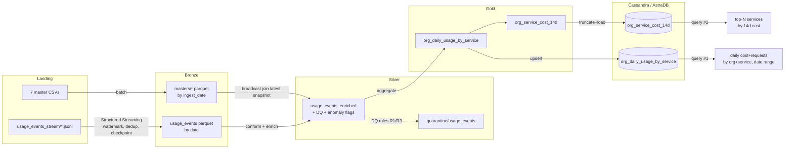

# Cloud Provider Analytics — End-to-End MVP (Segundo Parcial)

A minimal but complete data pipeline: **landing → Bronze → Silver → Gold →
Serving (Cassandra)** built with PySpark + Structured Streaming, against the
provided Cloud Provider Analytics dataset (7 CSV masters + 120 JSONL usage-event
files, 43,200 events).

The whole pipeline is one script, `pipeline.py` (jupytext "percent" format), with
pure transforms factored into `cpa.py` and the Cassandra serving layer in
`serving.py`. `pipeline.ipynb` is the generated Colab notebook.

## Architecture (MVP scope)

Lambda pattern; for the MVP the **streaming** path covers only landing→Bronze of
usage events, and everything after runs as **batch** over the Bronze Parquet.



## Quickstart (local)

Prereqs: [uv](https://docs.astral.sh/uv/), a JDK 17 or 21 (Spark needs it), and
Docker (for local Cassandra).

```bash
cd segundo-parcial

# 1. Python env (uv pins Python 3.12 + installs pyspark, cassandra-driver, ...)
uv sync

# 2. Local Cassandra
docker run -d --name cpa-cassandra -p 9042:9042 cassandra:5
# wait ~40s until ready:
until docker exec cpa-cassandra cqlsh -e "describe keyspaces" >/dev/null 2>&1; do sleep 3; done

# 3. Run the pipeline (JAVA_HOME must point at a JDK 17/21)
JAVA_HOME=/usr/lib/jvm/java-21-temurin-jdk uv run python pipeline.py
```

This ingests masters + streams events to Bronze, builds Silver (DQ + quarantine +
anomaly), Gold (`org_daily_usage_by_service` + `org_service_cost_14d`), loads both
Cassandra tables, runs business queries #1 and #2, and prints the idempotency /
partition evidence. **Re-run it and the per-zone counts are identical.**

### Tests

```bash
JAVA_HOME=/usr/lib/jvm/java-21-temurin-jdk uv run pytest -q
```

Pure-transform unit tests (schema registry, Silver, Gold) always run; the
Cassandra serving tests run if a local Cassandra is reachable, else skip.

## Colab

Open `pipeline.ipynb` in Colab and run top-to-bottom. `LOCAL` auto-detects Colab
and uses `BASE=/content/datalake`; `!pip install pyspark cassandra-driver` and
clone this repo so `cpa.py` / `serving.py` / the `datalake/landing` data are
present. Point `SERVING_TARGET` at `astra` (below) since Colab has no local
Cassandra.

## AstraDB (final serving evidence)

The rubric asks for the two queries run against **AstraDB**. The code is
identical — only the connection switches.

1. Create a free Serverless database at [astra.datastax.com], keyspace
   **`cloud_analytics`**.
2. Download the **Secure Connect Bundle** (`.zip`) and generate an **Application
   Token** (`AstraCS:...`).
3. Load + query against Astra:
   ```bash
   ASTRA_BUNDLE=/path/secure-connect-...zip \
   ASTRA_TOKEN=AstraCS:xxxxx \
   SERVING_TARGET=astra \
   JAVA_HOME=/usr/lib/jvm/java-21-temurin-jdk \
   uv run python pipeline.py
   ```
4. In the AstraDB **CQL Console**, run the two queries from `cql/queries.cql` and
   screenshot the results.

## Layout

```
segundo-parcial/
  pipeline.py        # driver (jupytext percent) — read top to bottom
  pipeline.ipynb     # generated notebook for Colab
  cpa.py             # pure: schema registry + Silver/Gold transforms
  serving.py         # Cassandra connect / DDL / upsert / queries
  cql/               # schema.cql + queries.cql
  tests/             # pytest (schema, Silver, Gold unit; serving integration)
  datalake/
    landing/         # source data (committed)
    bronze/ silver/ gold/ quarantine/ checkpoints/   # generated (gitignored)
  DECISIONS.md       # design rationale + thresholds
```

See `DECISIONS.md` for the Lambda scope, partition/watermark/Cassandra-key
choices, DQ thresholds, and the idempotency design.
