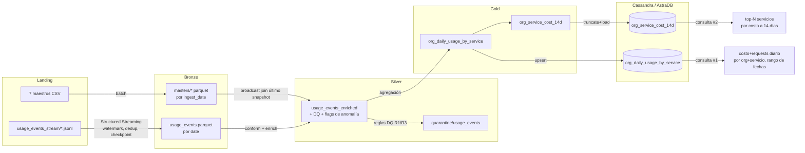

# Cloud Provider Analytics — MVP End-to-End (Segundo Parcial)

Un pipeline de datos mínimo pero completo: **landing → Bronze → Silver → Gold →
Serving (Cassandra)** construido con PySpark + Structured Streaming, sobre el
dataset provisto Cloud Provider Analytics (7 maestros CSV + 120 archivos JSONL de
usage events, 43.200 eventos).

Todo el pipeline es un único script, `pipeline.py` (formato jupytext "percent"),
con las transformaciones puras factorizadas en `cpa.py` y la capa de serving de
Cassandra en `serving.py`. `pipeline.ipynb` es el notebook generado para Colab.

## Arquitectura (alcance del MVP)

Patrón Lambda; para el MVP el camino de **streaming** cubre solo landing→Bronze de
los usage events, y todo lo que sigue corre como **batch** sobre el Parquet de
Bronze.



## Quickstart (local)

Requisitos: [uv](https://docs.astral.sh/uv/), un JDK 17 o 21 (Spark lo necesita) y
Docker (para la Cassandra local).

```bash
cd segundo-parcial

# 1. Entorno Python (uv fija Python 3.12 + instala pyspark, cassandra-driver, ...)
uv sync

# 2. Cassandra local
docker run -d --name cpa-cassandra -p 9042:9042 cassandra:5
# esperar ~40s hasta que esté lista:
until docker exec cpa-cassandra cqlsh -e "describe keyspaces" >/dev/null 2>&1; do sleep 3; done

# 3. Correr el pipeline (JAVA_HOME debe apuntar a un JDK 17/21)
JAVA_HOME=/usr/lib/jvm/java-21-temurin-jdk uv run python pipeline.py
```

Esto ingesta los maestros + streamea los eventos a Bronze, construye Silver (DQ +
quarantine + anomalía), Gold (`org_daily_usage_by_service` + `org_service_cost_14d`),
carga ambas tablas de Cassandra, ejecuta las consultas de negocio #1 y #2, e
imprime la evidencia de idempotencia / particionado. **Volvé a correrlo y los
conteos por zona son idénticos.**

### Tests

```bash
JAVA_HOME=/usr/lib/jvm/java-21-temurin-jdk uv run pytest -q
```

Los tests unitarios de transformaciones puras (registro de esquemas, Silver, Gold)
siempre corren; los tests de serving de Cassandra corren si hay una Cassandra local
accesible, si no se saltean.

## Colab

Abrí `pipeline.ipynb` en Colab y corré de arriba a abajo. La primera celda
(**Bootstrap de Colab**) se autodetecta en Colab y hace todo el setup: clona este
repo, instala `pyspark` + `cassandra-driver` + un JDK 17, y se posiciona en
`segundo-parcial/` para que `cpa.py`, `serving.py` y `datalake/landing` queden en
rutas relativas. No hace falta nada manual. Como Colab no tiene Cassandra local,
apuntá `SERVING_TARGET=astra` (ver abajo) — por ejemplo, definiendo las variables
de entorno en una celda antes de ejecutar el resto.

## AstraDB (evidencia final de serving)

La consigna pide las dos consultas corridas contra **AstraDB**. El código es
idéntico — solo cambia la conexión.

1. Creá una base Serverless gratuita en [astra.datastax.com], keyspace
   **`cloud_analytics`**.
2. Descargá el **Secure Connect Bundle** (`.zip`) y generá un **Application Token**
   (`AstraCS:...`).
3. Cargá + consultá contra Astra:
   ```bash
   ASTRA_BUNDLE=/ruta/secure-connect-...zip \
   ASTRA_TOKEN=AstraCS:xxxxx \
   SERVING_TARGET=astra \
   JAVA_HOME=/usr/lib/jvm/java-21-temurin-jdk \
   uv run python pipeline.py
   ```
4. En la **CQL Console** de AstraDB, ejecutá las dos consultas de `cql/queries.cql`
   y sacá captura de los resultados.

Las capturas de las dos consultas corridas contra AstraDB están en
[`evidence/astra/`](evidence/astra/README.md).

## Estructura

```
segundo-parcial/
  pipeline.py        # driver (jupytext percent) — leer de arriba a abajo
  pipeline.ipynb     # notebook generado para Colab
  cpa.py             # puro: registro de esquemas + transformaciones Silver/Gold
  serving.py         # Cassandra connect / DDL / upsert / consultas
  cql/               # schema.cql + queries.cql
  tests/             # pytest (esquema, Silver, Gold unit; serving integración)
  datalake/
    landing/         # datos fuente (versionados)
    bronze/ silver/ gold/ quarantine/ checkpoints/   # generados (en gitignore)
  DECISIONS.md       # rationale de diseño + umbrales
```

Ver `DECISIONS.md` para el alcance Lambda, las elecciones de
partición/watermark/claves-Cassandra, los umbrales de DQ y el diseño de
idempotencia.
