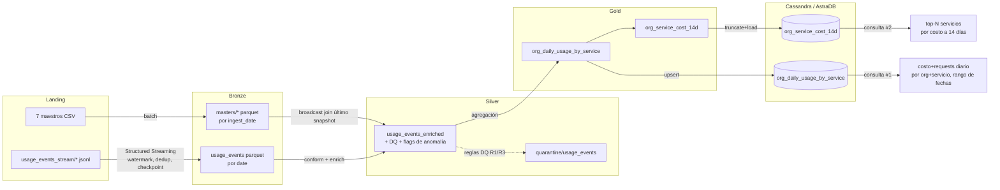

# Big Data - Cloud Provider Analytics TP2

**Materia:** Big Data -72.80
**Fecha de entrega:** 15 de junio 2026
**Integrantes:**

- Perez de Gracia, Mateo (63401)
- Quian Blanco, Francisco (63006)
- Stanfield, Theo (63403)

## Objetivo

Un pipeline de datos mínimo pero completo: **landing → Bronze → Silver → Gold →
Serving (Cassandra)** construido con PySpark + Structured Streaming, sobre el
dataset provisto Cloud Provider Analytics (7 maestros CSV + 120 archivos JSONL de
usage events).

Todo el pipeline es un único script, `pipeline.py` (formato jupytext "percent"),
con las transformaciones puras factorizadas en `cpa.py` y la capa de serving de
Cassandra en `serving.py`. `pipeline.ipynb` es el notebook generado para Colab.

## Arquitectura (alcance del MVP)

Patrón Lambda. Para el MVP el camino de **streaming** cubre solo landing→Bronze de
los usage events, y todo lo que sigue corre como **batch** sobre el Parquet de
Bronze.



## Quickstart (AstraDB)

El serving va contra **AstraDB** (Cassandra serverless gestionada). El mismo
`pipeline.py` corre igual en tu máquina con `uv` o en Colab; lo único que cambia
es de dónde toma las credenciales de Astra.

### 1. Conseguir las credenciales de Astra (una sola vez)

1. Creá una base **Serverless** gratuita en [astra.datastax.com](https://astra.datastax.com).
2. Dentro de la base, creá el keyspace **`cloud_analytics`**.
3. Descargá el **Secure Connect Bundle** (`secure-connect-...zip`).
4. Generá un **Application Token** (`AstraCS:...`) con un rol que pueda escribir
   (p. ej. *Database Administrator*) y copiá el valor **completo**.

### 2a. Correr local con uv

Requisitos: [uv](https://docs.astral.sh/uv/) y un JDK 17 o 21.

```bash
cd segundo-parcial

# Entorno Python (uv fija Python 3.12 + instala pyspark, cassandra-driver, ...)
uv sync

# Correr el pipeline contra Astra
ASTRA_BUNDLE=/ruta/secure-connect-...zip \
ASTRA_TOKEN=AstraCS:xxxxx \
SERVING_TARGET=astra \
JAVA_HOME=/usr/lib/jvm/java-21-temurin-jdk \
uv run python pipeline.py
```

### 2b. Correr en Colab

Abrí `pipeline.ipynb` en Colab y corré de arriba a abajo. La primera celda
(**Bootstrap de Colab**) se autodetecta y hace todo el setup: clona este repo,
instala `pyspark` + `cassandra-driver` + un JDK 17, y se posiciona en
`segundo-parcial/` para que `cpa.py`, `serving.py` y `datalake/landing` queden en
rutas relativas. No hace falta nada manual.

La celda **AstraDB en Colab** (justo después del bootstrap) configura el serving
sola; antes de correrla, solo necesitás:

1. En Colab, panel **🔑 (Secrets)** → agregar un secret llamado **`ASTRA_TOKEN`**
   con el valor `AstraCS:...` y habilitar "Notebook access". Así el token no queda
   escrito en el `.ipynb`.
2. Al correr la celda, subir el **secure-connect-bundle** (`.zip`) en el file
   picker (queda cacheado; en re-runs no lo vuelve a pedir).

### Qué hace una corrida

Cualquiera de las dos vías ingesta los maestros + streamea los eventos a Bronze,
construye Silver (DQ + quarantine + anomalía), Gold (`org_daily_usage_by_service`
+ `org_service_cost_14d`), carga ambas tablas en Astra, ejecuta las consultas de
negocio #1 y #2, e imprime la evidencia de idempotencia / particionado. **Volvé a
correrlo y los conteos por zona son idénticos.**

Para sacar las capturas finales, en la **CQL Console** de AstraDB ejecutá las dos
consultas de `cql/queries.cql`. Las capturas ya tomadas están en
[`evidence/astra/`](evidence/astra/README.md).

### Tests

```bash
JAVA_HOME=/usr/lib/jvm/java-21-temurin-jdk uv run pytest -q
```

Los tests unitarios de transformaciones puras (registro de esquemas, Silver, Gold)
siempre corren; los tests de serving de Cassandra corren si hay una Cassandra local
accesible, si no se saltean.

## Alternativa: Cassandra local con Docker

Si no podés usar Astra (sin conexión, problemas de credenciales, etc.), el serving
corre igual contra una Cassandra local en Docker — es el valor por defecto
(`SERVING_TARGET=docker`). Requiere Docker además de `uv` y el JDK.

```bash
cd segundo-parcial
uv sync

# Cassandra local
docker run -d --name cpa-cassandra -p 9042:9042 cassandra:5
# esperar ~40s hasta que esté lista:
until docker exec cpa-cassandra cqlsh -e "describe keyspaces" >/dev/null 2>&1; do sleep 3; done

# Correr el pipeline (SERVING_TARGET=docker es el default)
JAVA_HOME=/usr/lib/jvm/java-21-temurin-jdk uv run python pipeline.py
```

## Estructura

```
segundo-parcial/
  pipeline.py        # driver (jupytext percent) — leer de arriba a abajo
  pipeline.ipynb     # notebook generado para Colab
  cpa.py             # puro: registro de esquemas + transformaciones Silver/Gold
  serving.py         # Cassandra connect / DDL / upsert / consultas
  cql/               # schema.cql + queries.cql
  tests/             # pytest (esquema, Silver, Gold unit; serving integración)
  datalake/
    landing/         # datos fuente (versionados)
    bronze/ silver/ gold/ quarantine/ checkpoints/   # generados (en gitignore)
  DECISIONS.md       # rationale de diseño + umbrales
```

Ver `DECISIONS.md` para el alcance Lambda, las elecciones de
partición/watermark/claves-Cassandra, los umbrales de DQ y el diseño de
idempotencia.
