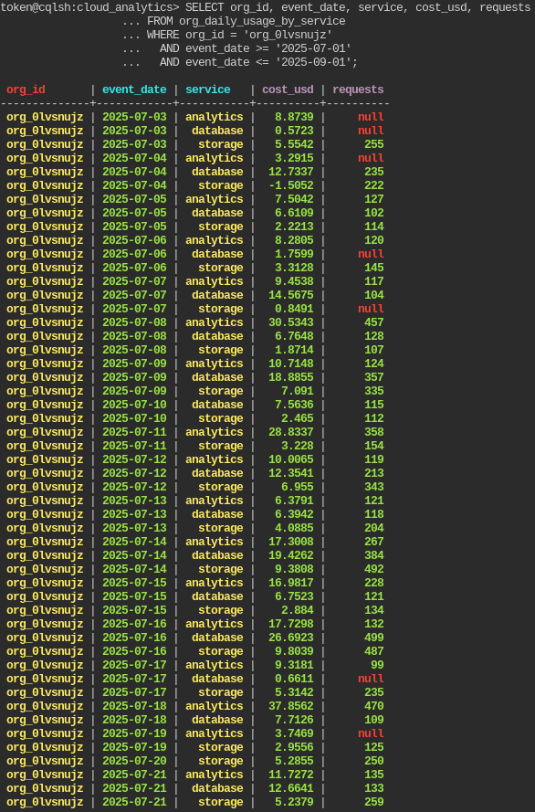
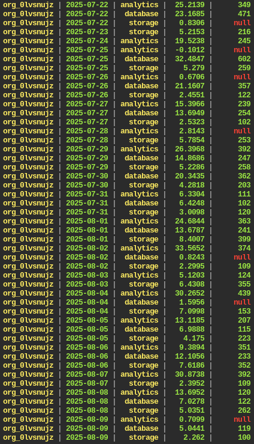
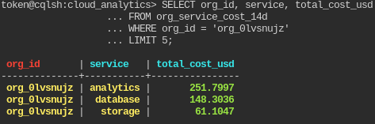

# Evidencia de serving — consultas sobre AstraDB

Las dos consultas obligatorias ejecutadas en la **CQL Console** de AstraDB
(keyspace `cloud_analytics`), con las tablas cargadas por `pipeline.py` con
`SERVING_TARGET=astra`. El CQL exacto está en [`../../cql/queries.cql`](../../cql/queries.cql).

## Consulta #1 — costo + requests diario por org + servicio (rango de fechas)

```cql
SELECT org_id, event_date, service, cost_usd, requests
  FROM org_daily_usage_by_service
 WHERE org_id = 'org_0lvsnujz'
   AND event_date >= '2025-07-01'
   AND event_date <= '2025-09-01';
```

Partición por `org_id`, range-slice sobre la columna de clustering `event_date`.





## Consulta #2 — top-N servicios por costo acumulado a 14 días

```cql
SELECT org_id, service, total_cost_usd
  FROM org_service_cost_14d
 WHERE org_id = 'org_0lvsnujz'
 LIMIT 5;
```

El `CLUSTERING ORDER BY (total_cost_usd DESC)` devuelve el top-N directo, sin sort
del lado del cliente: `analytics 251.80`, `database 148.30`, `storage 61.10`.


